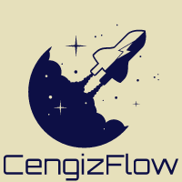

# Training with NeptuneAI and Optuna

<p align="center">
  
</p>

**Abstract:** This project includes training pipeline, experiment tracking, model versioning and hyperparameter tuning based on gender classification problem. The focus is on practicing the tools used, not the problem that model solves. It is easy to implement different dataloaders and modify last layer of model etc.

# Installation
## Dataset
CelebAHQ dataset was used for training and WIKI dataset was used for validation. Processed images can be downloaded from [here](https://drive.google.com/file/d/1karOtT_tB34SW8I-dcQZ-vGR5NKMJqxY/view?usp=sharing) then unzip file to [src/Data](src/Data)
```
CelebAHQ: 30000 images
WIKI: 38455 images
```
## Configs
All training and hyperparameter tuning parameters can be changed from the [trainConfig.yml](src/Options/trainConfig.yml) file. Descriptions of all parameters are available in the file.
## Environment
### Anaconda
```
conda create --name genderTrain python==3.7.13
conda activate genderTrain
pip install -r requirements.txt

# For Cuda 11.1
pip install torch==1.10.1+cu111 torchvision==0.11.2+cu111 -f https://download.pytorch.org/whl/torch_stable.html

# For Cuda 10.2
pip install torch==1.10.1+cu102 torchvision==0.11.2+cu102 -f https://download.pytorch.org/whl/torch_stable.html

python train.py
```
### Docker
```
docker build -t train .
docker run --runtime=nvidia -it train train.py
```
### Secret Variables for NeptuneAI
After creating account on Neptune.ai, API token is required to connect to the project. There are several ways to find your keys. Here is the [link](https://docs.neptune.ai/getting-started/installation#authentication-neptune-api-token). You need to add your informations to `secrets.ini` like [example](secretsExample.ini).

## Create Account on Neptune.ai
The website can be accessed from this [link](https://neptune.ai) and follow sign up button to create free account. After logging in, you will see the projects on the screen. From here, we create a new project from the `New Project` button. After filling in the information about the projects, we will see examples of how the project can be implemented to your training pipeline. Also, you can find your `api token` from here. You can investigate [Trainer](src/Trainer.py) class to understand how Neptune.ai can be implemented to training pipeline.

### Step 1
<p align="center">
  
</p>

### Step 2
<p align="center">
  
</p>

### Step 3
<p align="center">
  
</p>

## Experiment Tracking Examples
In this case, we are proceeding through gender classification and we check whether the model is saving or not from the `Validation Accuracy` metric. Here we give examples of screens to follow our experiments/runs and models from the Neptune.ai website. Also, there is a lots of informations about your experiments while checking your runs. For example, you can check your loss/accuracy graphs, source code changes, monitor hardware usages etc. Finally, all thing that mentioned before can be customizable with respect to your experiment type.

<p align="center">
  
</p>

<p align="center">
  
</p>

<p align="center">
  
</p>